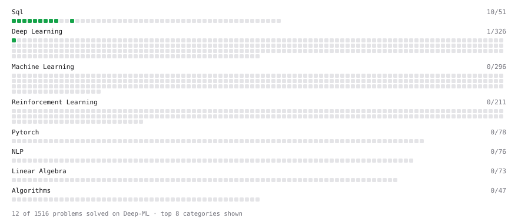

# Deep-ML

My machine learning practice from [Deep-ML](https://www.deep-ml.com). Every solution here was written by hand.

**14** solved · 12 problems · 0 labs · 2 math

[**Browse the interactive portfolio**](https://hasitapattapu.github.io/deep-ml/) to replay this filling in over time.

## Problems

| | Difficulty | Solved | |
| --- | --- | --- | --- |
| [Average per group](https://www.deep-ml.com/problems/1108) | easy | 2026-10-04 | [solution](problems/1108-average-per-group) |
| [Count rows per group](https://www.deep-ml.com/problems/1107) | easy | 2026-10-04 | [solution](problems/1107-count-rows-per-group) |
| [Delete Duplicate Emails Keeping One](https://www.deep-ml.com/problems/1112) | easy | 2026-10-08 | [solution](problems/1112-delete-duplicate-emails-keeping-one) |
| [Filter rows with WHERE](https://www.deep-ml.com/problems/1103) | easy | 2026-10-01 | [solution](problems/1103-filter-rows-with-where) |
| [Handle Missing Data in pandas (dropna/fillna)](https://www.deep-ml.com/problems/1128) | easy | 2026-10-05 | [solution](problems/1128-handle-missing-data-in-pandas-dropna-fillna) |
| [Remove duplicates with DISTINCT](https://www.deep-ml.com/problems/1105) | easy | 2026-10-02 | [solution](problems/1105-remove-duplicates-with-distinct) |
| [SELECT all rows](https://www.deep-ml.com/problems/1101) | easy | 2026-10-01 | [solution](problems/1101-select-all-rows) |
| [Select specific columns](https://www.deep-ml.com/problems/1102) | easy | 2026-10-01 | [solution](problems/1102-select-specific-columns) |
| [Sigmoid Activation Function Understanding](https://www.deep-ml.com/problems/22) | easy | 2026-10-04 | [solution](problems/0022-sigmoid-activation-function-understanding) |
| [Sort results with ORDER BY](https://www.deep-ml.com/problems/1104) | easy | 2026-10-01 | [solution](problems/1104-sort-results-with-order-by) |
| [Top N with LIMIT](https://www.deep-ml.com/problems/1106) | easy | 2026-10-02 | [solution](problems/1106-top-n-with-limit) |
| [Your first JOIN](https://www.deep-ml.com/problems/1109) | easy | 2026-10-06 | [solution](problems/1109-your-first-join) |

## Math

| | Difficulty | Solved | |
| --- | --- | --- | --- |
| [Descriptive Statistics](https://www.deep-ml.com/math-problems/18) | easy | 2026-10-02 | [solution](math/0018-descriptive-statistics) |
| [Probability Fundamentals](https://www.deep-ml.com/math-problems/19) | easy | 2026-10-03 | [solution](math/0019-probability-fundamentals) |

---

_This file is regenerated by Deep-ML on every push._
